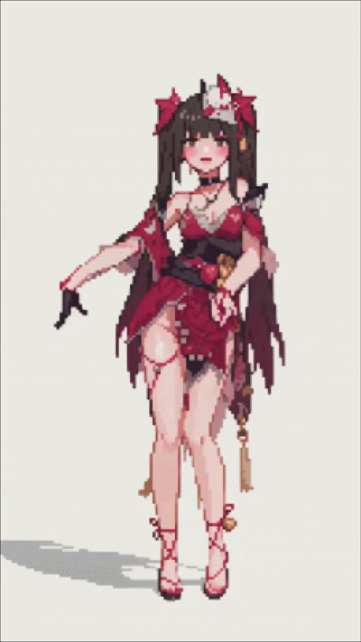
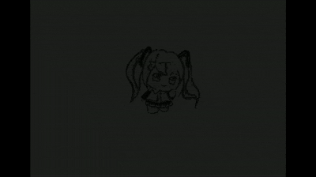

<br>
<p align="center">
  <pre>
 █████╗ ███████╗ ██████╗██╗██╗    █████╗ ██████╗ ████████╗
██╔══██╗██╔════╝██╔════╝██║██║   ██╔══██╗██╔══██╗╚══██╔══╝
███████║███████╗██║     ██║██║   ███████║██████╔╝   ██║
██╔══██║╚════██║██║     ██║██║   ██╔══██║██╔══██╗   ██║
██║  ██║███████║╚██████╗██║██║   ██║  ██║██║  ██║   ██║
╚═╝  ╚═╝╚══════╝ ╚═════╝╚═╝╚═╝   ╚═╝  ╚═╝╚═╝  ╚═╝   ╚═╝
  </pre>
</p>

<p align="center">
  <b>Terminal Art Player</b>
  <br>
  video → character art. in your terminal. in real time.
  <br><br>
  <a href="README_CN.md">中文文档</a>
</p>

---

<br>

<p align="center">
  
  <br><sub>Mode C — half-block HD</sub>
</p>

<p align="center">
  
  <br><sub>Mode A — classic gradient style</sub>
</p>

<br>

### what

drop a video or image on it. it plays back as animated character art in your terminal.

- **3 backends** — ASCII density · ANSI true color · half-block HD
- **6 character styles** — classic gradient, minimal lines, matrix 01, ink brush, vintage print, dot matrix
- **dot-matrix mode** — binary `*` threshold, density = brightness, raw and beautiful
- **dedicated terminal** — pops a new window auto-sized to your video
- **audio passthrough** — ffmpeg extracts the track, loops with frames
- **export** — render to MP4 with audio, multi-threaded

<br>

### install

```bash
git clone https://github.com/Atnagnohil/TerminalArt.git && cd TerminalArt
uv sync
```

Python 3.12+. ffmpeg optional (export audio only).

<br>

### run

```bash
uv run python -m main                     # GUI
uv run python -m main video.mp4           # CLI quick-play
uv run python -m main --console-play video.mp4 --mode C   # auto-fit terminal
```

<br>

### modes

> **A · ASCII**
> grayscale mapped to character density. choose from 6 styles in the dropdown or `--style`.

> **B · ANSI Color**
> every pixel a colored `█`. 24-bit, closest to source.

> **C · Half-block HD**
> `▀` packs two pixels per cell. double vertical resolution. the sharpest option.

<br>

### character styles (mode A)

| style | chars | vibe |
|---:|:---|:---|
| `classic` | ` .:-=+*#%@` | smooth 10-level gradient |
| `minimal` | `./\|*` | stark, high-contrast |
| `matrix` | `01` | cyberpunk code rain |
| `ink` | `丶丿丨乀` | textured brush strokes |
| `vintage` | `@%#*+=-:. ` | old-school line printer |
| `dot` | `*` | binary dot matrix, threshold gated |

<br>

### dot matrix

mode A & B. adjustable brightness cutoff — above → `*`, below → blank. lower threshold = denser dots. no dithering, just yes/no per pixel.

<br>

### cli flags

```
--mode A/B/C       --style classic/minimal/matrix/ink/vintage/dot
--dot-mode 0/1     --threshold 0-255    --fps N
--loop 0/1         --cols N
```

<br>

### export

play once in the GUI (frames cache in background) → hit **Save**. multi-threaded render, auto audio mux if ffmpeg is on PATH.

<br>

### a note on quality

Terminal playback is limited by the cmd window size — you can't fit thousands of characters on screen. This hits **mode A** the hardest: at ~100×30 characters, the grayscale gradient can feel blocky compared to what you'd expect.

If you want the real deal, **save it as a video and watch that instead**. The exported MP4 isn't constrained by your terminal — it encodes every character pixel at full resolution. Character height defaults to 200, and the result is significantly sharper than what you'd see in the terminal.

On render speed: **mode A is fast** (NumPy vectorized, frame-by-frame is near-instant). **Modes B and C are slower** — they parse ANSI per-pixel and render colored glyphs. This is normal. Plan accordingly for longer videos.

### trouble?

- **cmd.exe garbled** → use Windows Terminal
- **video overflows** → `--console-play` auto-fits, or make the terminal bigger
- **export has no sound** → install ffmpeg
- **dots too sparse** → lower threshold, try 80-100

<br>

### layout

```
src/
├── main.py                    # entry: gui / cli / console-play
├── core/
│   ├── char_mapper.py         # pixel → ansi (A/B/C + styles)
│   ├── media_decoder.py       # video → numpy frames
│   ├── terminal_renderer.py   # timing, output, audio
│   └── file_saver.py          # mp4 / txt / html export
├── gui/
│   └── main_window.py         # tkinter panel
└── utils/
    ├── ansi_to_html.py        # ansi → css
    └── terminal_utils.py      # cursor, size, clear
```

<br>

### built with

<p align="center">
  
  
  
  
  
  
  
</p>

<br>
